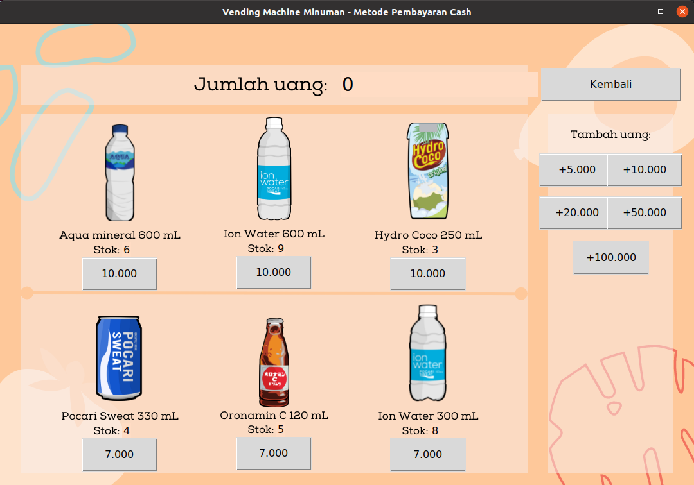

# Tubes-Pengkom

Program ini dibuat oleh kelompok 4 dari kelas K16, khusus untuk menyelesaikan tugas besar mata kuliah KU1102 Pengenalan Komputasi.
1. 16521122 Kevin Prayoga Abdinegara
2. 16521432 Syafiq Ziyadul Arifin
3. 16521462 Nindya Dwi Larasati
4. 16521472 Alarik Unggul Yudhatama Sukadis 

## Requirements
1. Python 3.x
2. tkinter
3. requests
4. qrcode
5. imageio

## How to Use
1. `pip install -r requirements.txt`
2. `python3 vendingmachine.py`